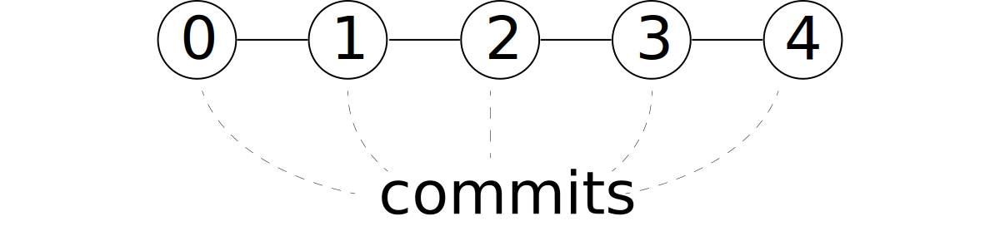
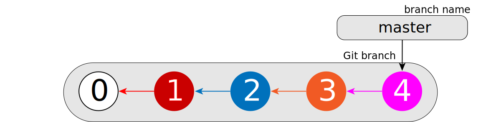
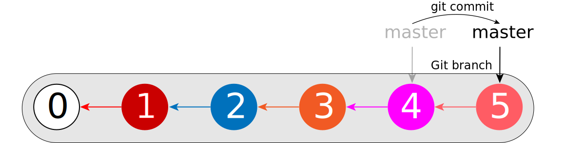

## Commit -- commit -- ...

Let's discuss what happens when we change some file several times and diligently record every
change we make in a Git repository.

> ## Git 101: Commits
>
> In the image above, how many commits do you expect to see in a Git repository at the end?
>
> * 4
> * 5
> * 9
>
> > ## Solution
> > The correct answer is **5** commits:
> > the "Initial Commit" with "Original Version" and 4 subsequent versions.
> {: .solution}
{: .challenge}

> ## Git 101: Basic commands
>
> What Git commands do we have to execute to record a change in a Git repository?
>
>  1. `git init` followed by `git commit` followed by `git push`
>  2. `git init` followed by `git push`
>  3. `git add` followed by `git commit`
>  4. `git push`
>
> > ## Solution
> > The correct answer is **3**: `git add` followed by `git commit`.
> {: .solution}
{: .challenge}

The above editing procedure results in the following commits added to the Git history:

Here we drew lines connecting adjacent commits. We did this on purpose because commits in Git are
indeed "connected" to each other. How exactly? Let's find out!

> ## Persona: Working at the 'Mega Store'
>
> This is a good time to introduce our "Persona" for this lesson.
> We are an employee in a recently opened store called 'Mega Store'.
> There are several departments and we work in one of them (the instructor will tell you which one).
> To our surprise, the store owner (a.k.a. "The Boss") wants us to use Git in our work.
> This highly collaborative and incredibly friendly environment stimulates us to learn a little bit
> more about Git <s>than we wanted</s>.
>
> Please download the following repository to your desktop:
> `https://github.com/maxim-belkin/itpf_store`.
>
> > ## Which command do you plan to use?
> >
> > 1. `git get`
> > 2. `git pull`
> > 3. `git clone`
> > 4. `git copy`
> >
> > > ## Solution
> > > The correct answer is **3**: `git clone`. The full command is:
> > > ~~~
> > > git clone https://github.com/maxim-belkin/itpf_store
> > > ~~~
> > > {: .language-bash}
> > {: .solution}
> {: .challenge}
{: .callout}

## What's in your commit

Let's begin by checking out the history of the commits in our freshly cloned repository:

~~~
git log --oneline 86032ed
~~~
{: .language-bash}

~~~
86032ed (HEAD -> master) Our Mission
9f187a2 Our tagline
e22d9df Adding our all-star management
518d8b5 Adding departments
4685727 Initial commit.
~~~
{: .output}

It shows us the commit history in **reverse chronological order** starting from `86032ed` and up to
(or down to) the very first commit. But why does `git log` show commit history in **reverse**
chronological order? The answer to this question lies in the content of Git commits.  Let's have a
closer look at one of the commits, say `e22d9df`:

~~~
git cat-file -p e22d9df
~~~
{: .language-bash}

~~~
tree 2609321927d5872fcf19905fc2fb656c570eafdd
parent 518d8b5ac966604d57030d9e2b9a1299de7cb820
author Maxim Belkin <maxim.belkin@gmail.com> 1573043165 -0600
committer Maxim Belkin <maxim.belkin@gmail.com> 1573043165 -0600
gpgsig -----BEGIN PGP SIGNATURE-----

 iQJLBAABCgA1FiEEoEV7mTIybOfwM4TyrHFWDUxfIzgFAl3Cu90XHG1heGltLmJl
 bGtpbkBnbWFpbC5jb20ACgkQrHFWDUxfIzhoChAAmuDrJmoZ6VvAvlq54bSeENrC
 2qcPyCOBkg8qzx2kNTDEkGpR4g8NNzgsgRRG23STlxxBNnGQYagsh6GbNPdATU36
 cvoompvZPAeUF6Rxy3Bk7N9i31VdN53ojwb7WiwQqGt7gHy8QkY580Kc7L0pgNcy
 XDid6rCIZRlxo4FqgXrp7AgmrHkOg+1KbFRenJac9xi4jP682/m4N90b8cut9b2h
 P+CKmUvPQtEuUO6G1C4hGnANYAycFdfKaoGuq2TRkf0n4kNvy1zT5SHcZRliN97o
 Zp7gwuW+7rMSODsviRcRn4pfFQIFQN9MkM1RO+CHOrtAUZ00LV3qjcmPyfNpeyH2
 f3SNno4/ZLD63Pdy7KThZdpcMZzmLyw4rgOmvFcW0KRorAk8T4h2JyLFk3+ujEw2
 jnLEij15ex9W61mm05tBVQj1urd+vi1B8BKd7JqqCUCtzaQKcP37F9C7bQJJtv/P
 aw3jJHxEUaBWz0iXbt5LYCLyhLbWDac4DQkTqk+gDf0VSQOexos507Ikbhz4c8se
 GRFwvqWwR/FrZdEOy4yOat9J7IOSEume4yVpyPNzzmhc+V8+9AdheRTXteGzQ+fP
 FymGkxIFYuduKgiRTFIwj0lZb54vSnd4zVU1vMAgyOusiy54DAQJl3gBlWDB2FVO
 1Ac2yFUfuR6PU43PmQ4=
 =k2fj
 -----END PGP SIGNATURE-----

Adding our all-star management
~~~
{: .output}

> ## `git cat-file`
>
> `git cat-file` allows us to inspect commits (and other objects) in the repository.
> `-p` flag instructs it to "pretty print" the content of the object.
>
> Note, that you can use `git cat-file -p` on **any** of the hashes you ever see in Git.
{: .callout}

Note the "parent" line in the output above.
This is how commits store information about their parent commits -- the commits they're attached to.
In Git, every* commit includes the following information:

- working directory content ("tree")
- its direct parent commit* ("parent")
- information about the person who created changes ("author")
- information about the person who added changes to the repo ("committer")
- commit message

and some additional information such as GPG signature (if any).

> ## Git 101: Parent-child relationships
>
> Test your understanding:
>
> * Does commit **0** ("Initial commit.") know about commit **1** ("Adding departments")?
> * Does commit **1** ("Adding departments") know about commit **0** ("Initial commit.")?
> * Does commit **2** ("Adding our all-star management") know about commit **0** ("Initial
>   commit.")?
>
> > ## Solution
> >
> > * No, because at the time commit **0** ("Initial commit.") is created there is no
> >   commit **1** ("Adding departments"") yet.
> > * Yes, we can check that with `git cat-file -p 518d8b5`.
> > * No, because commit **2** ("Adding our all-star management") knows about its _direct_
> >   predecessor only, which is commit **1** ("Adding departments").
> {: .solution}
{: .challenge}

Schematically, the fact that commits know their **direct** parents can be shown by adding arrows to
the diagram that we have previously shown:

Do you notice anything unusual about the commit **0**?
Yes, the initial commit does not point to any other commit.
Let's look at the initial commit using `git cat-file`:

~~~
git cat-file -p 4685727
~~~
{: .language-bash}

~~~
tree 2e3347d29bbd56d3e2a2f494c578107fb18c8694
author Maxim Belkin <maxim.belkin@gmail.com> 1573042942 -0600
committer Maxim Belkin <maxim.belkin@gmail.com> 1573043025 -0600
gpgsig -----BEGIN PGP SIGNATURE-----

 iQJLBAABCgA1FiEEoEV7mTIybOfwM4TyrHFWDUxfIzgFAl3Cu1EXHG1heGltLmJl
 bGtpbkBnbWFpbC5jb20ACgkQrHFWDUxfIzj4wQ//WSgO92CsQ5w+QD/5sjoqcmQs
 gMmrI1Lc9BOpHrNfbqPk6X0G+RwiQi/xP6/f+oRiYT08GcvC6ZvUPvGLBi0MNGB+
 GPKmutKBSdzEEl3kSIUO1R33eE0J5Z0QDCIzx7cxY93S0sVCvYr3y+hQEY6RQO+m
 BHr0hlG/BndtbSEhpC/9NXzR0LRiGmlvvUHVSQJ2ZpC/T3BrFKuToe/jqR1IVh4G
 Y1Ai9DAb5pQDjE7nqJByNA3UtQ2teii53Qiz1hynmxkZMI6WO4obPVdc3G/ZMnlc
 P6yYPyk/UIfmsNWIpTusFR9Go66ROceBnyBc4juA2Z5aGdYlooVoGUHI4Gtzfw4j
 hd5+bYn1E4GbU8JpnBbr64VzDhbcGVMHl6Ae7xrj3aWcOoqgSM+1q2FZQfxVgEdL
 SoeYpn4DNVFZS/r6HwpzqZZFWSMRZDdydseFAwx+fXkxzn1TOvZgk4/kyY02m0WF
 lzdJQrHJJam1qrv8vCh10PNQPN2H68G2OOkuTG5Y4BXD/QGD+hXKSGTmH7H6Won/
 zbMk05LzbpzbMXzjWcBq9H9kRjrUq4SHPBtI6qxVGHvpCS/w19LXibW3jNDGytKq
 +wyVu7JFH1J7lQEq6TofyMQ5Wa93qVCeP9A6mp16UOjnaJLHtkbAr1XDuBiQp3ZM
 7bOEOU9XPp/MXimJLSU=
 =iPp+
 -----END PGP SIGNATURE-----

Initial commit.

Yay!
~~~
{: .output}

Note no `parent:` line in the output above.
This means that it does not have a parent. It is an _orphan_ commit.
Usually, this is the only commit in a repository that has no parent(s).

## Chain reaction

Each commit carries the information about its direct parent.
On a diagram this can be indicated by using the same colors for the commits and the arrow
that goes out of it:

Because each commit knows its direct parents, it is easier for Git to processes commits in reverse
order than in the historical (chronological) order.
And this is why `git log` lists commits in reverse chronological order.

## Last in line

Clearly, the last commit is an important one.
Not only it determines the state of the working directory (what we see when we execute `ls` in a
Unix terminal or `dir` in Windows' Command Prompt)), it is also used as a starting point for many
Git commands.
It is, therefore, crucial for Git to quickly find this commit.

And for this purpose Git uses a simple text file with a _hash_ of that last commit.
This file is located inside of the repository (usually this is `.git` directory) in `refs/heads`
subdirectory.
Let's have a look at what we've got there:

~~~
ls .git/refs/heads
~~~
{: .language-bash}

~~~
master
~~~
{: .output}

## Yes, `master`!

Yes, the only file we currently have in this folder is called `master`.
Let's have a look at its contents:

~~~
cat .git/refs/heads/master
~~~
{: .language-bash}

~~~
86032ed9ad8e6671473c39829718a47ede844b52
~~~
{: .output}

This looks like a hash! And if we compare it to the output of `git log` above, we'll see that this
is the hash of the last commit! And it is indeed so. Here, `master` is the name of the sequence of
commits that we have in our repository. This is the default name. This sequence of commits is called
a branch.

This file (`.git/refs/heads/master`) contains the hash of the last commit in branch `master`.
If we add a new commit, this file will be updated.
Let's try it!

Let's add the following "Staff" section right under "Management":

~~~
## Staff

Departments' staff members are listed in corresponding files under 'staff' directory.
~~~
{: .source}

Now let's `git add` and `git commit` this change:

~~~
git add README.md
git commit -m "Adding 'Staff' section"
~~~
{: .language-bash}

~~~
[master d1fbc13] Adding 'Staff' section
 1 file changed, 5 insertions(+)
~~~
{: .output}

and check the contents of `.git/refs/heads/master`
~~~
cat .git/refs/heads/master
~~~
{: .language-bash}

~~~
d1fbc13485d81ce536ce6ccd57d80ddd8e2a8a84
~~~
{: .output}

Schematically, this is what happens when we add a new commit to a branch:

Now we know a part of the story about what happens inside the Git repository when we add a
new commit.

> ## Extracurricular activity: Advanced log
>
> Can you display history of commits starting at `518d8b5` and ending at `9f187a2`?
>
> > ## Solution
> >
> > This might surprise you but it is not as simple as `git log --oneline 518d8b5 9f187a2`.
> > There are a couple of ways we can do that:
> >
> > 1. Use `start..end` notation **and** append `~` (or `^`) to `start` in order to refer to the
> > parent of the `start` commit because the first commit in `start..end` notation (`start`) is not
> > included in the output of `log`:
> >     ~~~
> >     git log --oneline 518d8b5~..9f187a2
> >     git log --oneline 518d8b5^..9f187a2
> >     ~~~
> >     {: .language-bash}
> > 2. Use `A ^B` notation which shows all parents of A but hides parents of B. Note the different
> > meaning of `^` when it is prefixed to the commit hash rather than
> >     ~~~
> >     git log --oneline 9f187a2 ^518d8b5~
> >     ~~~
> >     {: .language-bash}
> > Check if the order of `9f187a2` and `^518d8b5~` matters.
> >
> > For more interesting ways to specify commit ranges, see the manual page for `gitrevisions` with
> > `git help revisions`.
> {: .solution}
{: .challenge}



